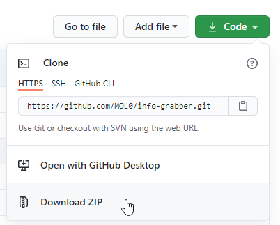
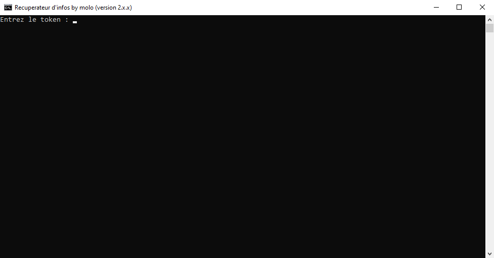

## Ce tool sert à obtenir des informations à partir d'un token
### Installation
Téléchargez simplement le zip  
  
Clic droit extraire  
### Utilisation
Ouvrez simplement start.bat et collez le token.  
  
Aucune information n'est sauvegardée et le code est open source.  
Vous pouvez même créer un raccourci du start.bat et mettre un raccourci clavier pour gagner encore plus de temps.  
### Note
Pour que le tool fonctionne même avec les comptes utilisateur (self bot), j'ai du utiliser une version modifiéé de discord.js.  
Si vous voulez en savoir plus allez voir [la page npm du module](https://www.npmjs.com/package/v11-discord.js)